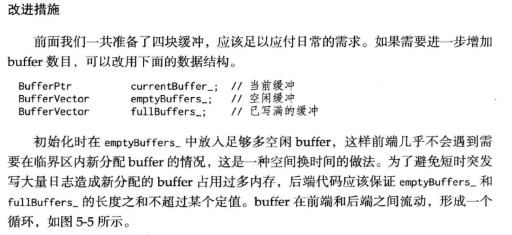

## 日志系统实现
## Log
Log的实现了学习了muduo，Log的实现分为前端和后端，前端往后端写，后端往磁盘写。为什么要这样区分前端和后端呢？因为只要涉及到IO，无论是网络IO还是磁盘IO，肯定是慢的，慢就会影响其它操作，必须让它快才行。

这里的Log前端是前面所述的IO线程，负责产生log，后端是Log线程，设计了多个缓冲区，负责收集前端产生的log，集中往磁盘写。这样，Log写到后端是没有障碍的，把慢的动作交给后端去做好了。

后端主要是由多个缓冲区构成的，集满了或者时间到了就向文件写一次。采用了muduo介绍了“双缓冲区”的思想，实际采用4个多的缓冲区(为什么说多呢？为什么4个可能不够用啊，要有备无患)。4个缓冲区分两组，每组的两个一个主要的，另一个防止第一个写满了没地方写，写满或者时间到了就和另外两个交换**指针**，然后把满的往文件里写。

与Log相关的类包括FileUtil、LogFile、AsyncLogging、LogStream、Logging。
其中前4个类每一个类都含有一个append函数，Log的设计也是主要围绕这个**append**函数展开的。

* FileUtil是最底层的文件类，封装了Log文件的打开、写入并在类析构的时候关闭文件，底层使用了标准IO，该append函数直接向文件写。
* LogFile进一步封装了FileUtil，并设置了一个循环次数，每过这么多次就flush一次。
* AsyncLogging是核心，它负责启动一个log线程，专门用来将log写入LogFile，应用了“双缓冲技术”，其实有4个以上的缓冲区，但思想是一样的。AsyncLogging负责(定时到或被填满时)将缓冲区中的数据写入LogFile中。
* LogStream主要用来格式化输出，重载了<<运算符，同时也有自己的一块缓冲区，这里缓冲区的存在是为了缓存一行，把多个<<的结果连成一块。
* Logging是对外接口，Logging类内涵一个LogStream对象，主要是为了每次打log的时候在log之前和之后加上固定的格式化的信息，比如打log的行、文件名等信息。
### 为什么需要异步日志？
因为若是由工作线程直接写入日志文件，会造成工作线程在进行I/O操作时陷入阻塞状态。这可能造成请求方超时，或者耽误发送心跳消息等。
### 为什么需要多缓冲？
前端不是将日志一条一条的传给后端，而是将多条日志拼成一个大buffer传给后端，减少了后端被唤醒的频率，降低了开销。
前端写日志时，当buffer满时，不必等待写磁盘操作。
为了及时将日志消息写入文件，即便前端buffer没满，每隔一段时间也会进行交换操作。
### 异步Log几秒钟才写一次磁盘，要是coredump了，这段时间内产生的log我去哪找啊？
其实这个问题非常简单了，也没花多少时间去解决，但我觉的非常好玩。coredump了自然会保存在core文件里了，无非就是把它找出来的问题了，在这里记录一下。

当然这里不管coredump的原因是什么，我只想看丢失的log。所以模拟的话在某个地方abort()就行

多线程调试嘛，先看线程信息，info thread，找到我的异步打印线程，切换进去看bt调用栈，正常是阻塞在条件变量是wait条件中的，frame切换到threadFunc(这个函数是我的异步log里面的循环的函数名)，剩下的就是print啦～不过，我的Buffer是用智能指针shared_ptr包裹的，直接->不行，gdb不识别，优化完.get()不让用，可能被inline掉了，只能直接从shared_ptr源码中找到_M_ptr成员来打印。

### 万一前端陷入死循环，拼命发送日志消息，超过后端的处理（输出）能力，会导致什么后果？
对于同步日志来说，这不是问题，因为阻塞IO自然就限制了前端的写 入速度，起到了节流阀（throttling）的作用。但是对于异步日志来说，这就是典型的生产速度高于消费速度问题，会造成数据在内存中堆积，严重时引发性能问题（可用内存不足）或程序崩溃(分配内存失败)

直接丢掉多余的日志buffer,以腾出内存。这样可以防止日志库本身引起程序故障，是一种自我保护措施。将来或许可以加上网络报警功能，通知人工介入, 以尽快修复故障
### 改进措施

## Buffer
### 需要自定义buffer的两个原因：

读数据的时候，不知道要接收的数据有多少，如果把缓冲区设计得太大会造成浪费。所以一个Buffer带有一个栈上的缓冲和堆上的缓冲，每次使用readv读取数据，先读到堆上那块缓冲再读到栈上那块缓冲，若栈上的缓冲有数据，则将其append到堆上的缓冲。栈上缓冲的大小为64KB，在一个不繁忙的系统上，程序一般等待在epoll()系统调用上，一有数据到达就会立刻唤醒应用程序来读取数据，那么每次read的数据不会超过几KB(一两个以太网frame)，陈硕在书中写到64KB缓冲足够容纳千兆网在500us内全速发送的数据。

写数据的时候，若已连接套接字对应的写缓冲区装不下了，剩下的没写的数据保存在自定义buffer中，然后监听已连接套接字上面的写事件，当写事件就绪时，继续将数据写入写缓冲区。若还写不完，继续保持监听写事件，若写完了，停止监听写事件，防止出现busyloop。

### 改进措施
1. 不使用vector<char> ,用环状buffer
2. zero copy buffer + writev （链表管理内存块）